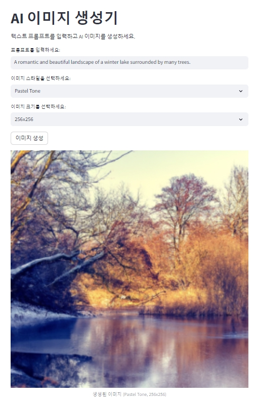

# 🎈 AI 이미지 생성기



## AI 이미지 생성기

이 프로젝트는 OpenAI API를 사용하여 텍스트 프롬프트를 입력하면 AI가 이미지를 생성해주는 간단한 Streamlit 애플리케이션입니다.

## 4. 사용 방법

앱 실행 후, 다음과 같은 단계를 통해 이미지를 생성할 수 있습니다.

1. **프롬프트 입력**: 텍스트로 AI가 이미지를 생성할 프롬프트를 입력합니다.
2. **이미지 스타일 선택**: Animation Style, Watercolor, Oil Painting, Pastel Tone 등 다양한 스타일 중 하나를 선택하세요.
3. **이미지 크기 선택**: 256x256, 512x512, 1024x1024 중 원하는 크기를 선택하세요.
4. **이미지 생성 버튼 클릭**: 모든 설정을 완료한 후, "이미지 생성" 버튼을 눌러 AI가 이미지를 생성합니다.

## A simple Streamlit app template for you to modify!

[](https://blank-app-template.streamlit.app/)

### How to run it on your own machine

1. Install the requirements

   ```
   $ pip install -r requirements.txt
   ```

2. Run the app

   ```
   $ streamlit run streamlit_app.py
   ```
  
---
  
### 폴더구조
  
```plaintext
📦 프로젝트 루트 디렉터리
├── 📁 images
│   └── image01.jpg
├── 📄 streamlit_app.py  
├── 📄 requirements.txt  
└── 📄 README.md  
```

  
